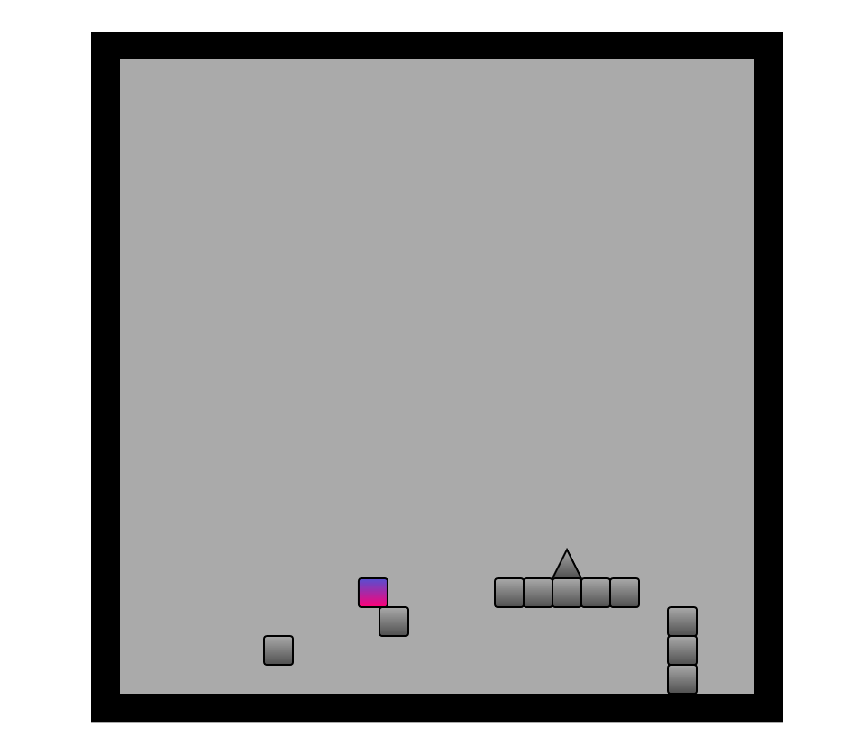

# :cyclone: Platformer Game

:point_right: A simple web platformer game for an university course, inspired by games like [Geometry Dash](https://www.robtopgames.com/) and [The Impossible Game](https://impossible.game/). 

> Very early development screenshot

Anyone can play maps without needing to log in. Users with an account can also create and publish their own maps, as well as rate the difficulty and review other people's maps.

 * :chart_with_upwards_trend: Terrible physics engine
 * :fire: No original concepts
 * :rocket: Blazingly slow
 * :tada: Essentially zero fun gameplay features
 * :hourglass: Will be shut down fifty seconds after the course is complete

## :zap: Running a local copy

> :zap: **Quick Instructions**: Needs **Python** with **Flask** installed. Use `python -m flask --app src/app.py run` to run the app in development mode.

These are the instructions for running a **local server** of the game. This means that the game connects to a **local database**, so all maps and reviews are stored only on your local computer.

1. Install [Python](https://www.python.org/downloads/).

2. After getting Python, install the **Flask** web development framework by running `pip install flask`.

3. Clone the repository via Git.

4. Make sure your Postgres service is running. Initialize the Postgres database by running `postgres -U <your_user_name> -f sql/setup.sql`.

5. You can then run a local server by running `python -m flask --app src/app.py run --debug`. This starts a new web server at [http://127.0.0.1:5000] by default.
